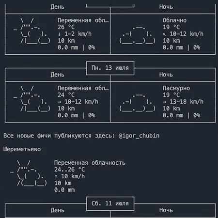

# WeatherCMD

Этот проект позволяет посмотреть погоду в городах - Лондон, Шереметьево и Череповец через командную строку.  
Пример использования. 
   
  
Установить библеотеки командой.  
```
pip install -r requirements.txt  
```
